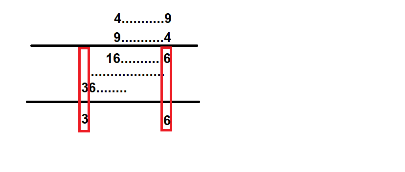

# CryptoCTF write up

This year I have not got a chance to compete in the CTF live. So I decided to up solve the challenges this year. Hopefully, the result is not too bad

Here are the challenge that I solved and the solve script (if I am not too lazy).

For each folder, the solver.py file is the solver script, all of the other files are attached file in the challenge. 


| Challenge | Difficulties | Solves | Scores | Done | 
| --------- | ------------ | -------| -------| -----|
| Baphomet  | easy         | 93     | 56     | ✔️  |
| Klamkin   | easy         | 83     | 61     | ✔️  |
| PolyRSA   | easy-medium  | 145    | 42     | ✔️  |
| SOTS      | easy-medium  | 113    | 49     | ✔️  |
| Jeksign   | easy-medium  | 45     | 100    | ✔️  |
| Volgo     | easy-medium  | 77     | 65     | ❌  |
| Keydream  | easy-medium  | 42     | 105    | ❌  |
| Infinity castle  | easy-medium  | 32     | 131    |❌   |
| Aniely    | medium       | 76     | 66     | ✔️  | 
| Diploma   | medium       | 68     | 71     | ✔️  | 

# Baphomet
The scheme first encode the flag using some kind of invertible operations (base64 encoding, inverse uppercase and lowercase). Finally the flag is xored with the key derived from the flag it self. What should be notice is the length of the flag (48 characters) and the length of the key, which is $len(flag) / 8 = 6$

This challenge is a basic xor cipher with known plaintext. The known plaintext is actually the format of the flag **CCTF{**, which is 5 characters in length. But the key is derived from the base64 encoded version of the flag, which means the first $5 / 3 * 4 = 6.333$ chars is known, which is just enought to recover the key.

After that just reverse all the process with the derived key to get the flag. The solver script could be found [here](../challenges/2022_cryptoctf/baphomet/solver.py)

# Klamkin
I did not understand the challenge at first for being bad at English :((((

## Challenge
Basically, you are given a diophantine equation with given $r, s$ and $q$
$$ar + bs = 0 \text{ (mod } q \text{)}$$

Then for all pair $(a, b)$ that satisfied the above equation, we need to find 2 coefficients $(x, y)$ such that
$$ax + by = 0 \text{ (mod } q \text{)}$$
with a constraint on the magnitude of $x, y$ depending on the requirement. Most of them is in the type of $x$ or $y$ is a $k$-bit number (where $k>12$)

## Solution
The idea is to use the same algorithm as the Euclidean algorithm to find the GCD of 2 numbers. So why ??

First notice besides the equation of form $$ar + bs = 0 \text{ (mod } q \text{)}$$, there is another trivial equation that is always true, which is $$aq + bq = 0 \text{ (mod } q \text{)}$$

Then 
$$a(q-s) + b(q-r) = 0 \text{ mod } q$$

Another stronger implication is 
$$a(q-ks) + b(q-kr) = 0 \text{ mod } q$$

Hence the coefficients for a could be reduce into a small enough value. Then for each query, the only thing needed to do is to multiply that coefficient to the appropriate value.

The solver script is [here](../challenges/2022_cryptoctf/klamkin/solver.py)

# PolyRSA
## Challenge
The challenge is about a textbook RSA where the value of $p,q$ are generated based on 2 polynomial 
```python
k = getRandomNBitInteger(nbit)
p = k**6 + 7*k**4 - 40*k**3 + 12*k**2 - 114*k + 31377
q = k**5 - 8*k**4 + 19*k**3 - 313*k**2 - 14*k + 14011
if isPrime(p) and isPrime(q):
    return p, q
```

The challege provide the value of $n$ and $c$. 
## Solution
The ideas is to multiply 2 polynomial and solve $f(k) = n$ for $k$ and recover 2 factors $p$ and $q$
The sage script can be found [here](../challenges/2022_cryptoctf/polyRSA/solver.sage)

# SOTS
## Thoughts
TBH, I have no ideas with this challenge. So let's google for something useful.

First I found [this](https://en.wikipedia.org/wiki/Sum_of_two_squares_theorem) and [this](https://en.wikipedia.org/wiki/Brahmagupta%E2%80%93Fibonacci_identity). 
So the idea is to factorise n to get prime factors, by somehow convert the prime factors into SOTS expression, and use the Brahmagupta identity to summary the final answer

This is quite clear for now. The question remains is how to express prime number as a sum of 2 square numbers.

After doing a bunch of googling, I found this [thread](https://math.stackexchange.com/questions/5877/efficiently-finding-two-squares-which-sum-to-a-prime). There are plenty algorithms that work, some of them involve in Gaussian number (which I don't understand). Then I saw on approach with Hermite-Serret algorithm

And fuck it. I can't factor N, so no flag here. Wtf is happening. Yup but you know how to do it. The script could be found [here](../challenges/2022_cryptoctf/SOTS/solve.sage)

# Jeksign
## Challenge:
The challenge require integer solution $(x, y,z)$ of the following equation with a constraint on the number of bits for z (30 - 49 bits)
$$1337(z^4 - x^2) = 31337(y^2 - z^4)$$

## Solution:
Notice that if $(x, y, z)$ is a solution of the above equation then $(4x, 4y, 2z)$ is also a solution with the number of bit of z increase by 1. Therefore, find 1 solution with z is a 30-bit number is enought.

Unforturnately, I don't know how to find one. But notice that there is also a trivial solution for the equation where both side of the equation is also 0, which is $(z^2, z^2, z)$

The script could be found [here](../challenges/2022_cryptoctf/jeksign/solve.py)

There might be a intended solution for this challenge but I didn't find it in the discord channel :(

# Keydream
## Challenge
The challenge is about a textbook RSA where $p, q$ byte representation are 2 inverse byte strings. Which means
```python
p = bytes_to_long(str)
q = bytes_to_long(str[::-1])
```

## Solution
So the ideas is try all possible pairs from both sides of the string to recover the representation string.

The condition for possible candidate is based on the modulo of lower bytes of n and upper bytes of n.

For clarification, take a look at the following example in base 10 (for the case of the challenge, use base 256)



However the result is not as good as desired, probably due to the checking condition. I spent over an hour for the check condition, and it is still not working.

# Aniely
Probably another unintended solution
## Challenge
The challenge provide a cipher based on the ChaCha20.

The key is derived by xoring the flag and the passphrase. Then it encrypts the passphrase using the derived key.

The cipher encrypt the message with a key by performing the following steps:
- Use the key as the key for ChaCha20 cipher to derive the key stream
- Xor the message with the generated key stream and another key of length 2.

```python
key = bytes(a ^ b for a, b in zip(flag, passphrase))
rand = urandom(2) * 16
enc = bytes(a ^ b ^ c for a, b, c in zip(passphrase, ChaCha20(key), rand))
```

The challenge provide the key, the encrypted version of the passphrase (enc).

## Solution
First note, since the prefix of the flag is known (CCTF{), the first few bytes of the passphrase is known by xor the known prefix with the key prefix.

Second note, when the key is provided, the keystream for xor operation is known. The first few bytes of the passphrase is also known, then the first 4 bytes of rand could be calculated as well. And that's more than enough since rand is a duplication of only 2 bytes.

Everything is known, the last thing to do is to retrieve the flag.
The solve script is attached [here](../challenges/2022_cryptoctf/aniely/solve.py)

# Diploma
## Challenge
The challenge require calculating the multiplicative order of a matrix in GF(p)

## Solution
I am not sure about the algorithm, but sagemath provide a built-in function to calculate that. The script is mostly about get the information through socket and call ```matrix.multiplicative_order()```.


# To read
Things that I might want to read further
- [ ] Gaussian numbers and operation on Gaussian number (how it can help solving the SOTS challenge)
- [ ] How to find multiplicative order of a matrix in Galois field