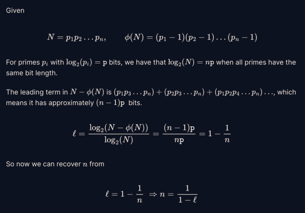

I was invited to make some Crypto challenges for HCMUS-CTF 2022 with some friends at university. First, I would like to give a great shout-out to **ffyytt** and **vuonghy2442** for their great challenges.

Next I would like to share some challenges that I have made and a short write up for them, and perhaps for challenges that I know how to solve (solution for challenge made by **vuonghy2442** might be available soon, after I know how to do it. Or I asked the author about that :(( )

## Table of contents:
|Challenge  |Tag| Score |
|:-------:  |:------:| :----------:|
|Substitution|Substitution, Frequency analysis|100|
|OH SEED|MT, PRNG|200|
|FactorMe|Math, Totient Function|200|
|SignMe|DSA|500|


# Qualification Round

## Substitution 1 and 2 (100pt)

**Author: me**

Every ctf should have a classical substitution cipher challenge, so I make one for this year (just because I have run out of ideas). The main idea is to solve the substitution cipher by using frequency analysis on ciphertext.

This could be done with plenty tools on the internet, such as [this](https://www.dcode.fr/substitution-cipher)

For part 2, instead using multialphabetical substitution cipher, I use a simple substitution and a shift operator with a deterministic offset sequence for each chunk of 5 characters. To solve for this, all you need is to shift the ciphertext back by the offset sequence, and solve it as in the first part.

## OH SEED (200pt)
**Author: ffyyt**

The challenge is to crack the random module of python by providing 665 random values, and then you have to guess the next number to get the flag.

Take a look at the code, we see that the generator was seeded with a random number that might be vulnerable to bruteforcing.

``` python
random.seed(time.time() + random.randint(0, 999999) + 1312 + hash(self.flag))
```

**time.time()** return the current time in seconds which is known. **random.randint(0, 999999)** is a random number between 0 and 999999, **1312** shift the range for the seed from 1312 to 1001311. The final part is **hash(self.flag)** which is the hash of the flag. 

Checking the value of **hash(self.flag)**, we found the the result of that is a random number in a wide range. This make it impossible to brute force the seed of the generator.

The second approach is to see what type of random number is used by **random** module in python. The source code could be found [here](https://github.com/python/cpython/blob/main/Lib/random.py). In the code, we found that it use Mersenne Twister algorithm for random generator. 

Mersenne Twister is not a cryptographic random generator, which means that it is possible to recover the inner state of the generator with sufficient number of samples. And in the case for Mersenne Twister, only 624 samples of 32-bit numbers are needed to recover the state.

For the implementation, use the [randcrack](https://github.com/tna0y/Python-random-module-cracker) module to recover the state. Solve script by **ffyytt**:

``` python
from pwn import *
from randcrack import RandCrack

n = 2**32-2
rc = RandCrack()
r = remote('192.168.1.6', 20202)
print(r.recvline().decode())
print(r.recvline().decode())
numbers = list(map(int, r.recvline().decode().split()))

for i in range(624):
    rc.submit(numbers[i])
    
for i in range(624, 665):
    print(f"GUESS: {rc.predict_randrange(0, n)}, TRUE: {numbers[i]}")
    
print(r.recvline().decode())
r.sendline(str(rc.predict_randrange(0, n)).encode())
print(r.recvline().decode())
print(r.recvline().decode())
print(r.recvline().decode())
```

## FactorMe (200pt)
**Author: me**

**NOTE**: This is a very sad challenge. The idea is quite interesting to me, but the setup for the challenge is so bad that some teams could solve it easily with unintended solution. :((

The challenge requires you to count the number of factors a number **n** given its [Euler's totient function](https://en.wikipedia.org/wiki/Euler%27s_totient_function). Take a closer look at how **n** is generated.

``` python
    def generateN(self, n_bits, n_primes):
        primes = set()
        while len(primes) < n_primes:
            p = getPrime(n_bits)
            primes.add(p)
        return list(primes), prod(primes)

    def getParam(self):
        n_bits = randint(96, 256)
        n_primes = randint(5, 20)
        return n_bits, n_primes
```

**n** in a product of **n_primes** primes, and each prime is a **n_bits**-bit number. Provided a number with its Euler's totient function, we could find all of its factors using the following [algorithm](https://math.stackexchange.com/questions/2916269/given-varphi-n-and-n-for-large-values-can-we-know-prime-factors-of-n). The sage code is also provided, however factoring n requires a lot of time, and it's not possible to solve this challenge in the timeout limit (as in the expectation of the author, sadly).

Since the challenge doest not require the list of all **n**'s factors, the intended solution is to approximate the number of factors without the need to factor **n**. The solution is based on an idea that if **n** consists of more factors then the value of **phi(n)** is greater.

The writeup is based on the discussion of **Jack#4818** and **Hellman#8492**, which is also the intended solution for this problem



**Credit: Jack#4818**

**Pitfall:** So what went wrong for this challenge. At first I thought that the time used for generating the list of primes was long, adding the time for network communication, therefore I set the timeout to be 45 second for 60 queries. However, it turns out that my solution works only in half of the time limit, and I did not test it properly before the contest. I should have reduce the time limit or increase the number of queries, or at least set the timeout after generate all value of n.

First one team solves the challenge by porting the sage code to native python code and able to solve it in time (I don't know how). 

The second team solution is based on the observation that all of the factors have the same number of bits. So all you need is to get 1 prime factors, and then you can get the number of factors by divide the number of bits of **n** by the number of bit of prime factor found.

Anyway, congratulation on two teams that solved the challenge.

## SignMe (500 pts)
**Author: me**

**NOTE** This is another failed challenge (you could tell since the number of solve for this challenge is much higher than the number of solve for factor me challenge). I will tell you why later.

The challenge implement the DSA algorithm. Everything looks normal except for the random value **k** is not generated randomly, but based on the value of the input message via a linear equation with secret coefficient.

``` python
msg = b64decode(pt)

if (len(msg) > self.N): # I know you are hecking :(((
    return (0, 0)

k = sum([coef * m for coef, m in zip(self.coef, msg)])
if k % 2 == 0: # Just to make k and p-1 coprime :)))
    k += 1

r = pow(self.g, k, self.p)
h = bytes_to_long(sha256(pt).digest())
s = ((h - self.x * r) * inverse(k, self.p - 1)) % (self.p - 1)
```

As you can see from the implementation, the value of **s** is based on the hash of the plaintext before decoded in base64, while the value of **k** is based on the decoded value of input. 

So the solution is to find the value of secret **self.x** by using the same nonce **k**. Since **s** is calculated based on **pt** not **msg**, we need to craft 2 messages $m_1$ and $m_2$ so that $b64decode(m_1) = b64decode(m_2)$ and $m_1 \neq m_2$.

Fortunately, base64 encoding is not bijective. So crafting $m_1$ and $m_2$ is not so difficult.

**Pitfall:** My linear equation lacks of a final random term. So if the message is 0 then k is 1. Many team exploit this to solve the challenge. Sadly :(

## Final
During the preparation for the contest, each challenge was given a score based on the difficulty of the challenge. After that, the score are set to be dynamic based on the number of solve for each challenge with the initial score of 500 pts. To my surprise, some of challenges has little solve while it actual score is not high. In the next part, I will reveal the actual score of each challenge.

|Name|Score|Category|
|---|---|---|
|QWERTY|100|Classical|
|RSA Backdoor|100|Math|
|Hash Extension|100|Hash length extension|
|RecoverMe|200|ARC4, Key recovery|
|CommonModulus|200|Common Modulus, RSA|
|Mixing Matrix v1|500|Linear Algebra|
|Mixing Matrix v2|500|Linear Algebra, Latice Reduction|

The writeup will be posted soon.